# Launch Guestbook App on Amazon EKS in 15 Minutes or Less

## Clone
This repo contains a Git submodule. Make sure to clone it with `--recurse-submodules` option.
```
git clone --recurse-submodules https://github.com/hasakura12/aws-eks-demo
```

## EKS and App Architecture Diagram
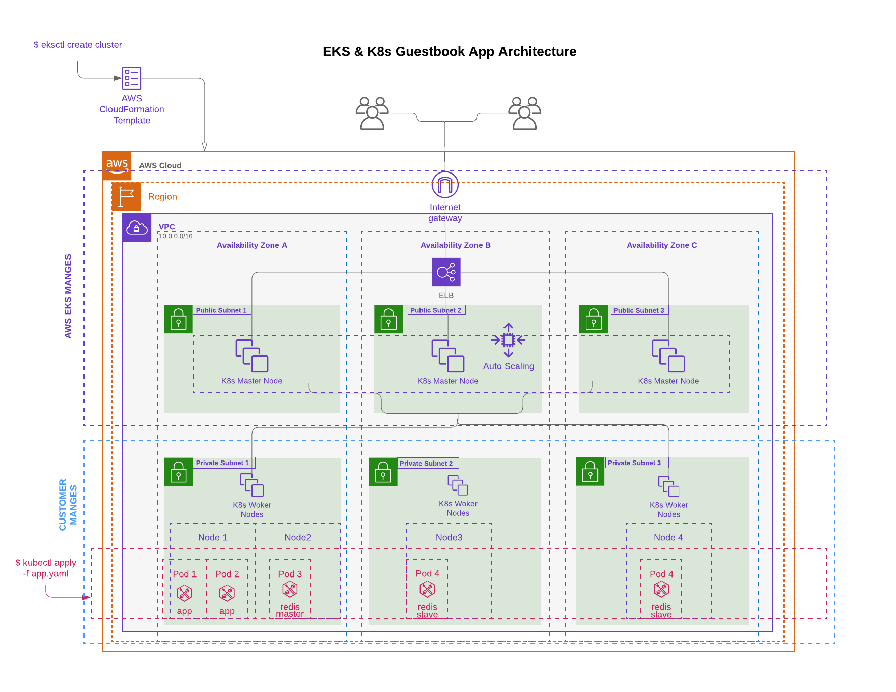

## Index
1. Prerequisites
2. Architecture Overview
3. Set up AWS K8s cluster and worker nodes in EKS
4. Deploy Apps in the cluster
5. Scale up and down
6. Rollout New Version
7. How to Test
8. Clean up

##  1. Prerequisites:
- AWS CLI
- [kubectl](https://kubernetes.io/docs/tasks/tools/install-kubectl/): K8s CLI to manage clusters (deploy pods, services, deployments, and more)
- [aws-iam-authenticator](https://docs.aws.amazon.com/eks/latest/userguide/install-aws-iam-authenticator.html): tool to let kubectl authenticate to EKS via AWS IAM (because K8s clusters resides within AWS)
- if deploying cluster using `eksctl`
  - [eksctl](https://docs.aws.amazon.com/eks/latest/userguide/getting-started-eksctl.html) (at least 0.1.37): CLI to create and manage clusters in AWS EKS
- if deploying cluster using `terraform`
  - terraform v0.12+
```
aws --version
aws-google-auth -p cr-labs-master
export AWS_PROFILE=cr-labs-<LAB-NAME-HERE>

# install kubectl on MacOS
brew install kubernetes-cli
kubectl version

# install aws-iam-authenticator
brew install aws-iam-authenticator

# install eksctl on MacOS
brew tap weaveworks/tap
brew install weaveworks/tap/eksctl
eksctl version

# terraform version needs to be v0.12+
terraform --version
```

## 2. Architecture Overview

### 2.1 K8s Architecture
Kubernetes (K8s) is a container orchestration tool. It manages and propagates changes across nodes. _Some_ of its functions are 1) load balancing and 2) maintaining high availability via the concept called _replica_ (i.e. AWS equivalent of _autoscaling group_). 

It has a master-worker node structure:
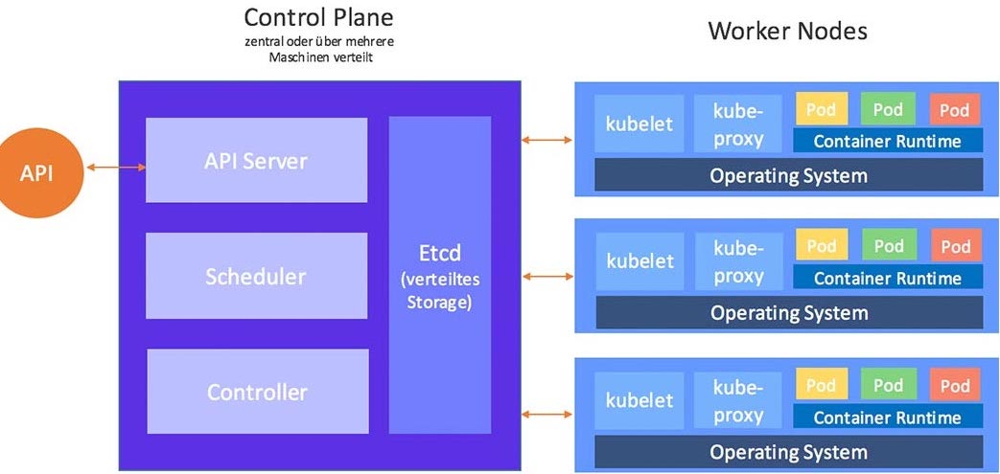

K8s components:
- Master node (i.e. AWS EKS calls this wrapper resource as _Control Plane_):
  - API server: interacts with `kubectl` CLI
  - Etcd: key-value store, implements locks
  - Controller: health check, makes sure pods are running
  - Scheduler: creates new pods and assign them to nodes
- Worker node: 
  - Kubelet: agent running on cluster nodes
  - Container runtime: such as Docker runtime
- Kubectl: CLI to manage/deploy apps on cluster


### 2.2 App Architecture
The app is highly available website backed by master-slave DBs.

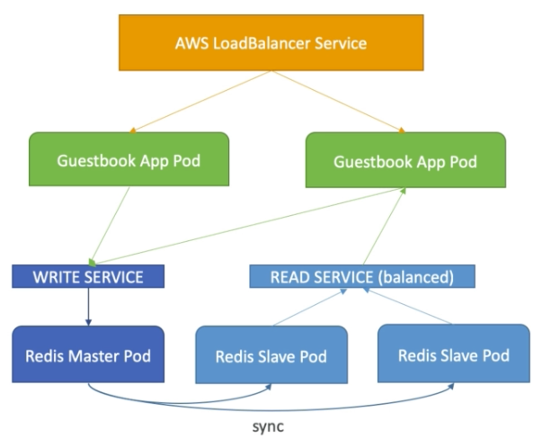
- Frontend PHP app
  - load balanced to public ELB
  - read request load balanced to multiple slaves
  - write request to a single master
- Backend Redis
  - single master (write)
  - multi slaves (read)
  - slaves sync continuously from master

### 2.3 EKS Architecture
The Amazon EKS control plane consists of control plane instances that run the Kubernetes software, such as etcd and the API server. The control plane runs in an account managed by AWS, and the Kubernetes API is exposed via the Amazon EKS API server endpoint. Each Amazon EKS cluster control plane is single-tenant and unique and runs on its own set of Amazon EC2 instances

Below diagram is EKS Control Plane resources that EKS is responsible for:
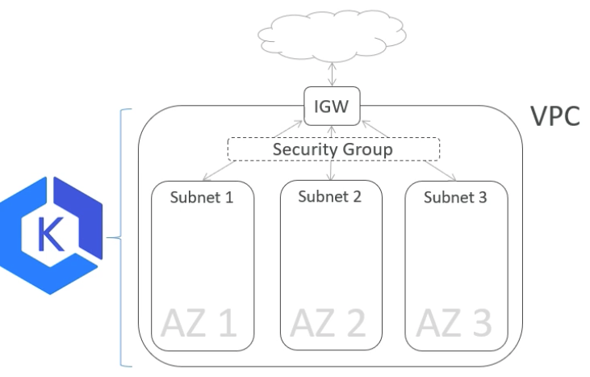


## 3. Set up AWS K8s cluster and worker nodes in EKS (infra)

Before deploying k8s pods and services and whatnot, we first need to create K8s clusters (master-worker nodes). 

You could set up a cluster in either `terraform` or `eksctl`.

### 3.1 Terraform
Terraform infra repo is fetched as a git submodule under `terraform-aws-eks-infra` folder. Cd into that directory first.
```
cd terraform-aws-eks-infra
```

#### Assumptions
- Terraform provider will assume a role to deploy resources (simulating an AWS identity in IAM account assuming a role into a shared/dev/prod account)
- We are using AWS profile `cr-labs-master` as an IAM account's identity
- we are using AWS profile `cr-labs-hisashi` to assume an IAM role. My `~/.aws/config` is below:
```
[profile cr-labs-hisashi]
source_profile = cr-labs-master
role_arn = arn:aws:iam::734811867068:role/Admin
region = eu-central-1
output = text
```

#### Step-by-Step
1. `export AWS_PROFILE=cr-labs-master`
2. `cd composition/eu-central-1/eks_cluster/dev`
3. `terraform init -backend-config=backend.config`
4. `terraform apply`
5. Write the kubeconfig file to `~/.kube/config` to allow kubectl client to connect to K8s cluster. 
```
mkdir ~/.kube
terraform output eks_kubeconfig > ~/.kube/config
```
6. get cluster info to validate kubectl works `kubectl cluster-info`
7. `export AWS_PROFILE=cr-labs-hisashi`
8. `kubectl get pods`
9. Join worker nodes to the cluster (this is important! Without this, pods can't be created at later steps)
```
kubectl apply -f config-map-aws-auth_eks-cluster-terraform.yaml
```


### 3.2 eksctl
`eksctl` tool will create K8s Control Plane (master nodes, etcd, API server, etc), worker nodes, VPC, Security Groups, Subnets, Routes, Internet Gateway, etc.

```
# create EKS cluster (control plane and worker nodes). Takes about 10 minutes
eksctl create cluster \
      --name EKS-by-eksctl \
      --version 1.13 \
      --nodegroup-name standard-workers \
      --node-type t3.medium \
      --nodes 3 \
      --nodes-min 1 \
      --nodes-max 4 \
      --node-ami auto
```
After 10 minutes or so, you should get the following outputs if successful
```
[ℹ]  using region eu-central-1
[ℹ]  setting availability zones to [eu-central-1a eu-central-1c eu-central-1b]
[ℹ]  subnets for eu-central-1a - public:192.168.0.0/19 private:192.168.96.0/19
[ℹ]  subnets for eu-central-1c - public:192.168.32.0/19 private:192.168.128.0/19
[ℹ]  subnets for eu-central-1b - public:192.168.64.0/19 private:192.168.160.0/19
[ℹ]  nodegroup "standard-workers" will use "ami-0b7127e7a2a38802a" [AmazonLinux2/1.13]
[ℹ]  creating EKS cluster "EKS-by-eksctl" in "eu-central-1" region
[ℹ]  will create 2 separate CloudFormation stacks for cluster itself and the initial nodegroup
[ℹ]  if you encounter any issues, check CloudFormation console or try 'eksctl utils describe-stacks --region=eu-central-1 --name=EKS-by-eksctl'
[ℹ]  2 sequential tasks: { create cluster control plane "EKS-by-eksctl", create nodegroup "standard-workers" }
[ℹ]  building cluster stack "eksctl-EKS-by-eksctl-cluster"
[ℹ]  deploying stack "eksctl-EKS-by-eksctl-cluster"
[ℹ]  building nodegroup stack "eksctl-EKS-by-eksctl-nodegroup-standard-workers"
[ℹ]  deploying stack "eksctl-EKS-by-eksctl-nodegroup-standard-workers"
[✔]  all EKS cluster resource for "EKS-by-eksctl" had been created
[✔]  saved kubeconfig as "/Users/hisashi.asakura/.kube/config"
[ℹ]  adding role "arn:aws:iam::734811867068:role/eksctl-EKS-by-eksctl-nodegroup-st-NodeInstanceRole-1M196AU2YU3J6" to auth ConfigMap
[ℹ]  nodegroup "standard-workers" has 0 node(s)
[ℹ]  waiting for at least 1 node(s) to become ready in "standard-workers"
[ℹ]  nodegroup "standard-workers" has 3 node(s)
[ℹ]  node "ip-192-168-14-211.eu-central-1.compute.internal" is not ready
[ℹ]  node "ip-192-168-37-79.eu-central-1.compute.internal" is ready
[ℹ]  node "ip-192-168-68-127.eu-central-1.compute.internal" is not ready
[ℹ]  kubectl command should work with "/Users/hisashi.asakura/.kube/config", try 'kubectl get nodes'
[✔]  EKS cluster "EKS-by-eksctl" in "eu-central-1" region is ready
```
```
# get info about cluster resources
aws eks describe-cluster --name EKS-by-eksctl

# get services
kubectl get svc
```
which should return the following at this point
```
NAME         TYPE        CLUSTER-IP   EXTERNAL-IP   PORT(S)   AGE
kubernetes   ClusterIP   10.100.0.1   <none>        443/TCP   11m
```

## 4. Deploy Apps in the cluster (apps)
Create resourecs in the diagram:


```
(note: you could save time by executing "kubectl apply -f guestbook/*" instead of individual yaml files below)

# Create the Redis master deployment
kubectl apply -f guestbook/redis-master-deployment.yaml

# Create the Redis master service
kubectl apply -f guestbook/redis-master-service.yaml

# Create the Redis slave deployment
kubectl apply -f guestbook/redis-slave-deployment.yaml

# Create the Redis slave service
kubectl apply -f guestbook/redis-slave-service.yaml

# Create the guestbook deployment
kubectl apply -f guestbook/frontend-deployment.yaml

# Create the guestbook service
kubectl apply -f guestbook/frontend-service.yaml
```

Now check resources created
```
kubectl get all
```
which should return the following (you see pod, service, deployment, and replicaset created)
```
NAME                                READY     STATUS    RESTARTS   AGE
pod/frontend-74b4665db5-b7dd9       1/1       Running   0          1m
pod/frontend-74b4665db5-kb2gc       1/1       Running   0          1m
pod/frontend-74b4665db5-sx46r       1/1       Running   0          1m
pod/redis-master-6fbbc44567-sjvxx   1/1       Running   0          2m
pod/redis-slave-74ccb764fc-7867p    1/1       Running   0          2m
pod/redis-slave-74ccb764fc-ctck5    1/1       Running   0          2m

NAME                   TYPE        CLUSTER-IP      EXTERNAL-IP   PORT(S)        AGE
service/frontend       NodePort    10.100.86.249   <none>        80:30139/TCP   1m
service/kubernetes     ClusterIP   10.100.0.1      <none>        443/TCP        22m
service/redis-master   ClusterIP   10.100.230.11   <none>        6379/TCP       2m
service/redis-slave    ClusterIP   10.100.14.72    <none>        6379/TCP       1m

NAME                           DESIRED   CURRENT   UP-TO-DATE   AVAILABLE   AGE
deployment.apps/frontend       3         3         3            3           1m
deployment.apps/redis-master   1         1         1            1           2m
deployment.apps/redis-slave    2         2         2            2           2m

NAME                                      DESIRED   CURRENT   READY     AGE
replicaset.apps/frontend-74b4665db5       3         3         3         1m
replicaset.apps/redis-master-6fbbc44567   1         1         1         2m
replicaset.apps/redis-slave-74ccb764fc    2         2         2         2m
```

Let's get a public ELB's name to access the app
```
kubectl get svc frontend -o wide
```
should return `EXTERNAL-IP` value, which is the ELB's DNS name. 
```
NAME       TYPE           CLUSTER-IP     EXTERNAL-IP                                                                  PORT(S)        AGE       SELECTOR
frontend   LoadBalancer   10.100.87.13   ae31361089e5a11e99c950aaba47976b-1924159193.eu-central-1.elb.amazonaws.com   80:32568/TCP   23s       app=guestbook,tier=frontend
```

Access the DNS name from a browser to see the guestbook app is working.
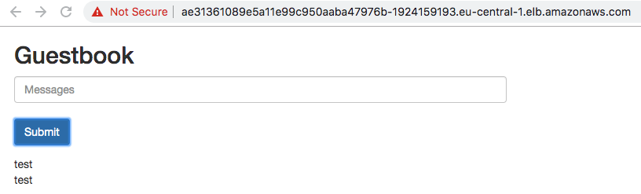

## 5. Scale Up and Down
You can scale up frontend deployment from current number of 3 to 4
```
kubectl scale deployment frontend --replicas 4
```
Verify now there are four frontend pods
```
kubectl get pods --selector tier=frontend
```
```
NAME                            READY     STATUS    RESTARTS   AGE
frontend-74b4665db5-95ntx       1/1       Running   0          2m
frontend-74b4665db5-b7dd9       1/1       Running   0          13m
frontend-74b4665db5-kb2gc       1/1       Running   0          13m
frontend-74b4665db5-sx46r       1/1       Running   0          13m
```

Now we can check Pod's IPs, their Nodes, and their Nodes secondary private IPs
```
# get frontend pod's IPs and DNS names of nodes frontend pods are deployed
kubectl get pods --selector tier=frontend -o wide | awk '{print $6 " " $7}'
IP NODE
192.168.41.203 ip-192-168-37-79.eu-central-1.compute.internal
192.168.3.124 ip-192-168-14-211.eu-central-1.compute.internal
192.168.45.244 ip-192-168-37-79.eu-central-1.compute.internal
192.168.80.155 ip-192-168-68-127.eu-central-1.compute.internal
```
Now check the EC2 instance with the private IP `ip-192-168-37-79` and you will see the secondary private IPs `192.168.41.203` and `192.168.45.244`, which are used by the pods

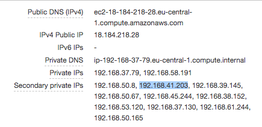

## 6. Rollout New Version
By default, K8s rolls out a new version of apps using rolling update.
```
# modify deployment yaml file, then rollout
kubectl rollout deployment frontend

# check status of rollout
kubectl rollout status deployment/frontend

# check history of rollout
kubectl rollout history deployment/frontend

# undo rollout
kubectl rollout undo deployment/frontend
```

## 7. How to Test (chaos monkey)
```
# open first terminal, display all resources (pod, service, deploymnet)
watch 'kc get deploy -o wide'

# open second terminal, delete one pod
kubectl delete pod frontend-74b4665db5-95ntx

# go back to the first terminal, one pod should be terminating but K8s should be creating one new node

# you can also manually terminate nodes (EC2 instances) and see the state changing
watch 'kc get nodes -o wide'
```
Remember nodes fault tolerancy and HA are configured by passing arguments to `eksct create cluster` command in the earlier step. In this example, minimum node is set to 1.
```
eksctl create cluster \
      --name EKS-by-eksctl \
      --version 1.13 \
      --nodegroup-name standard-workers \
      --node-type t3.medium \
      --nodes 3 \
      --nodes-min 1 \
      --nodes-max 4 \
      --node-ami auto
```

## 8. Clean up
```
# delete K8s apps
kubectl delete deploy --all
kubectl delete service --all

# delete EKS cluster
eksctl delete cluster --name EKS-by-eksctl --region eu-central-1
```

---

## AWS EKS & K8s Concepts Walkthrough
- general architecture
- which part of the cluster AWS manages
- which part of the cluster do customers need to manage
- AWS networking
- K8s networking
- EKS authentication
- K8s integration with AWS native service
- AWS CLI vs EKSCTL
  - Set up AWS EKS cluster via AWS CLI

## Which part of the cluster AWS (EKS) manages
EKS makes K8s Control Plane and Worker nodes highly available by replicating them in three different AZs.
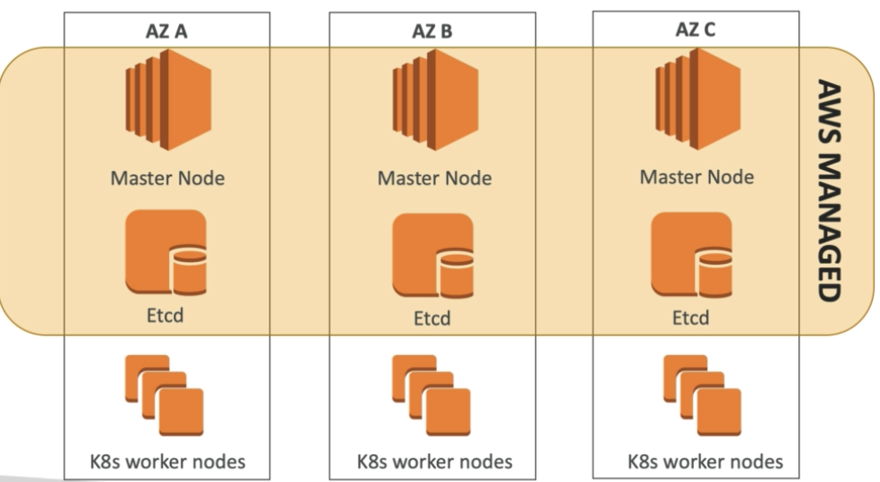

## Which part of the cluster do customers need to manage
EKS manages Control Plane. Customers manage Worker nodes.


## AWS networking
EKS requires the following AWS networking resources:
- VPC
  - must enable DNS hostname otherwise nodes can't register
- public subnets
  - contains internet-facing ELB
- private subnets
  - contains worker nodes that host applications
- Security Groups
  - control plane SG (public subnets)
    - ingress: 443 from worker nodes SG
    - egress: 1025 - 65535 to worker ndoes SG
  - worker nodes SG (private subnets)
 
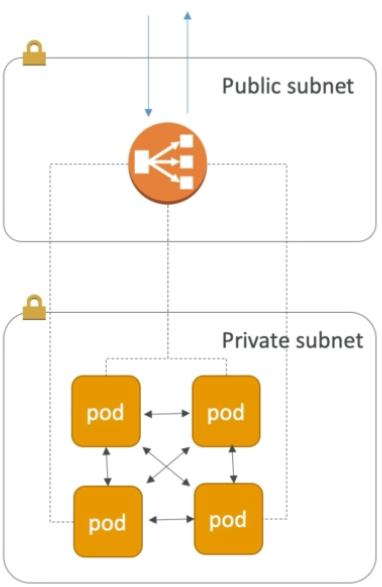

Security Groups for K8s master and worker nodes
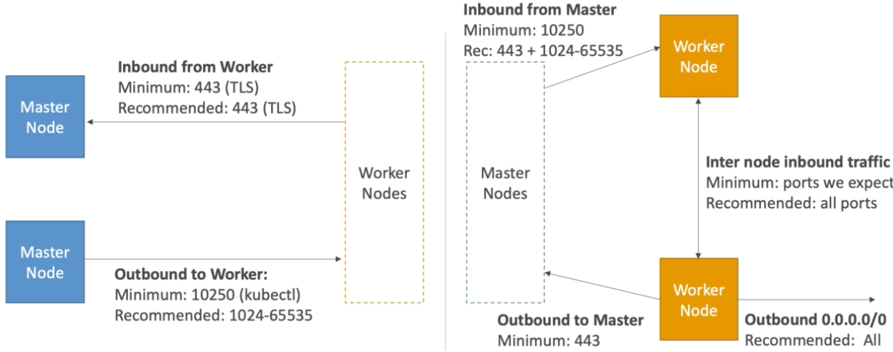
- NIC/IP
  - EC2 can have only so many IPs depending on instance type
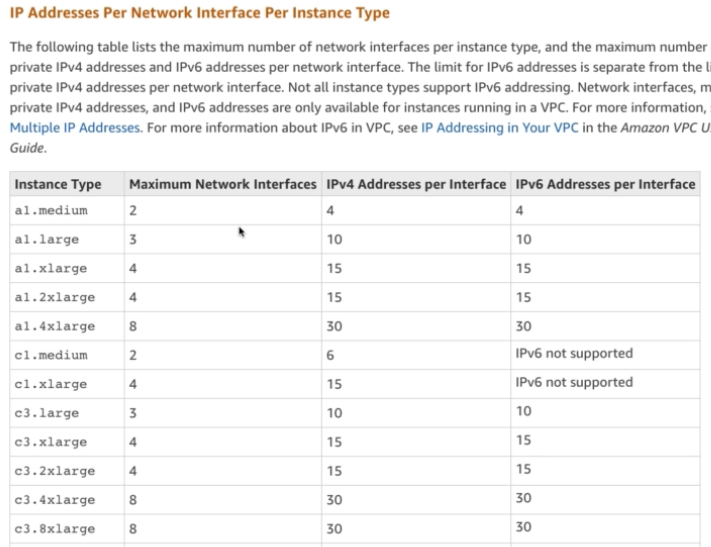

## K8s networking
In Kubernetes, there is a mechanism called Network Policy (i.e. just like AWS Security Group) to control ingress/egress traffic to pods

- Network Policy
  - inter-pods firewall/security group alike via tags, IPs, CIDR.
  - by default, a pod can access any other pods in any other nods within a cluster by IP or service name 
- Service
  - abstract (ephemeral nature of) pods by grouping them using a service name
  - [load balancer](https://kubernetes.io/docs/concepts/services-networking/service/#loadbalancer)
    - CLB is the default for the service type of LoadBalancer
    - NLB can be specified
    - [ALB for Ingress Controller (open source)](https://github.com/kubernetes-sigs/aws-alb-ingress-controller)
      - supports target group of instance mode and IP mode
      - supports ALB listner rules
      - SSL support, access logs, etc
    - downside: one load balancer per one service (i.e. what if adding more apps, hence more services? More load balancers needed... enters Ingress below)
- Ingress: single externally accessible URL abstracting services (i.e. kind of can be thought of as API Gateway)
  - ingress controller
  - ingress backends (rules can be path or host name)

## EKS authentication
When you manage K8s resources in AWS EKS using `kubectl` from your shell, `kubectl` needs to authenticate and authorize your identity. This is done by the tool `aws-iam-authenticator`, which configures `kubectl` (config stored in `~/.kube/config`) what IAM role to use for which K8s cluster, what CA to use, etc. 

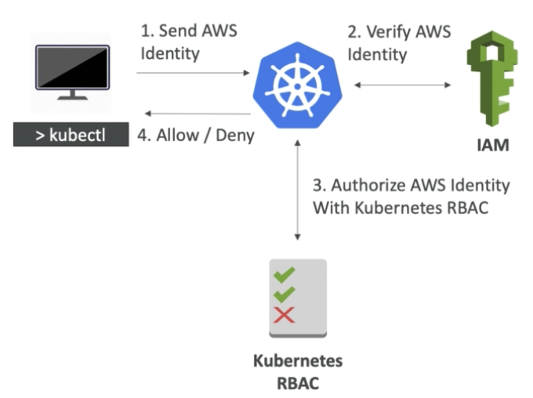

Here is the snippet of `~/.kube/config`
```
kind: Config
preferences: {}
users:
- name: 1562161313388116000@prod.eu-central-1.eksctl.io
  user:
    exec:
      apiVersion: client.authentication.k8s.io/v1alpha1
      args:
      - token
      - -i
      - prod
      command: aws-iam-authenticator
      env: null
```

- AWS IAM
  - authentication
- K8s RBAC
  - authorization


- Nodes authentication
  - IAM role assigned to worker nodes, and the IAM role ARN added to Config Map `aws-auth`
  - 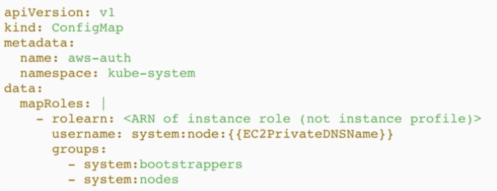


## K8s integration with AWS native services
- VPC
- ELB
- EC2
- ASG

## K8s Dashboard
K8s dashboard GUI

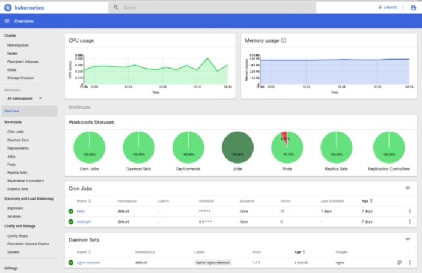

K8s dashboard architecture

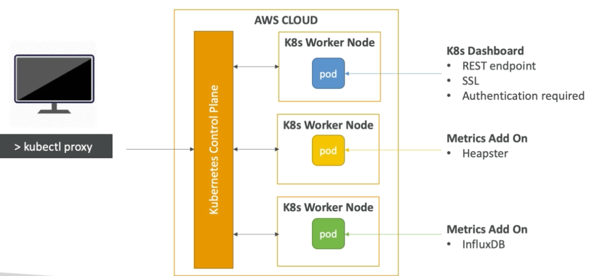

[Deploy K8s Dashboad](https://docs.aws.amazon.com/eks/latest/userguide/dashboard-tutorial.html)

## AWS CLI vs EKSCTL
### AWS CLI
#### Set up AWS EKS cluster (_without_ worker nodes) via AWS CLI
```
# 1. create IAM role with permissions to create EKS cluster

# 2. create subnets and securityg group

# 3. create EKS cluster
aws eks create-cluster --name EKS-by-cli --role-arn ARN --resources-vpc-config subnetIds=IDs,securityGroupIds=ID

# 4. check cluster is created
aws eks list-clusters
aws eks describe-cluster EKS-by-cli

# 5. delete the cluster
aws eks delete-cluster --name EKS-by-cli
```

#### Downside of using AWS CLI to create cluster
- creates only Control Plane (master node)
- needs to create worker nodes sepaeately either manually or through IaC (CloudFormation or Terraform)


### EKSCTL 
Much more feature rich CLI than AWS CLI for eks.
#### Set up AWS EKS cluster _and_ worker nodes via EKSCTL
```
# 1. create IAM role with permissions to create EKS cluster

# 2. create subnets and securityg group

# 3. create EKS cluster abd worker nodes (under the hood, two CloudFormation stacks, cluster and nodegroup, are created)
eksctl create cluster --region eu-central-1 --name EKS-by-eksctl

# resources created for master nodes are: 
# - one VPC
# - six subnets & route tables (public and private subnets x three AZs)
# - internet gateway and NAT gateway
# - two security groups (one for cluster, the other for nodegroup)
# - control plane for EKS master nodes
# for worker nodes:
# - ASG with two EC2 instances for worker nodes

# 4. check cluster is created
eksctl get clusters
eksctl get cluster --name EKS-by-eksctl --region eu-central-1

# 5. scale worker nodes to four
eksctl scale nodegroup --nodes=4 --name EKS-by-eksctl --region eu-central-1

# 6. use kubectl (great thing about eksctl is it configures kubectl. No need to configure ~/.kube/config)
kubectl get all

# 7. delete the cluster
eksctl delete cluster --name EKS-by-eksctl --region eu-central-1
```


### Further Readings
- K8s best practices
  - https://github.com/freach/kubernetes-security-best-practice
  - https://github.com/gravitational/workshop/blob/master/k8sprod.md
  - https://speakerdeck.com/thesandlord/kubernetes-best-practices